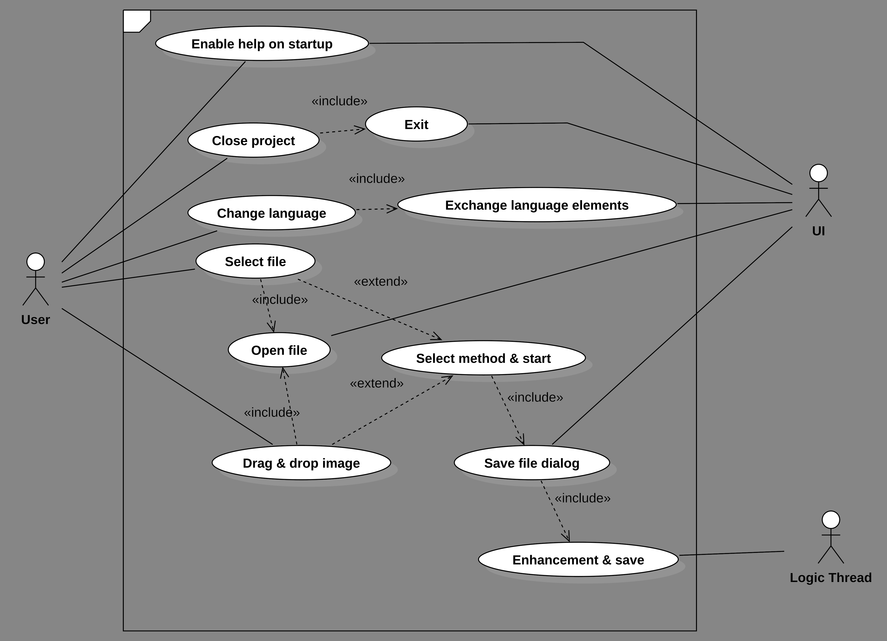
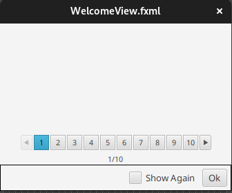
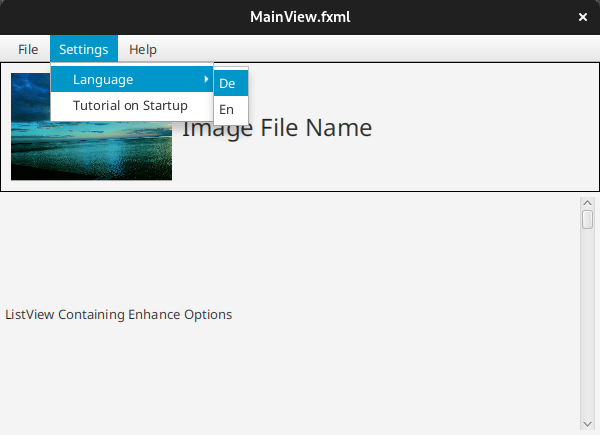
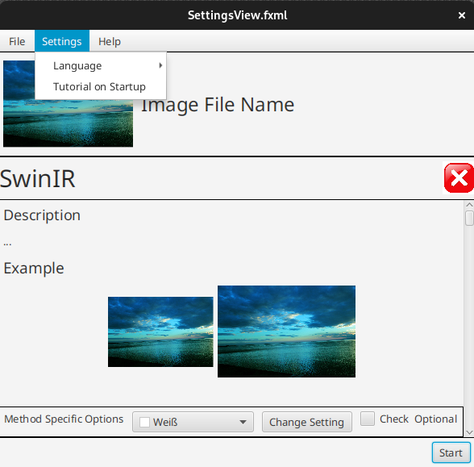
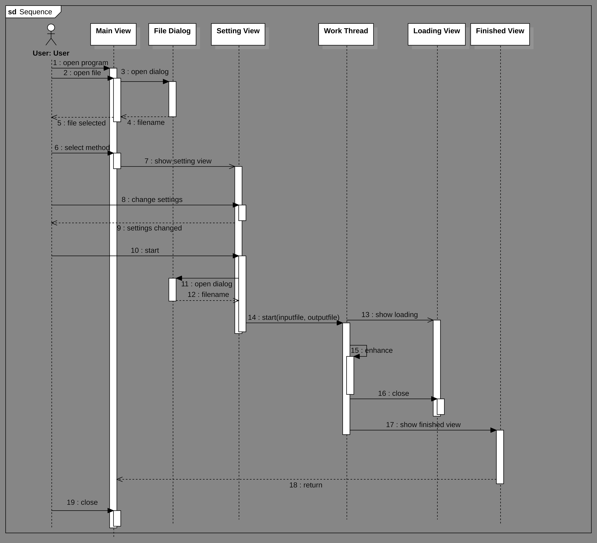
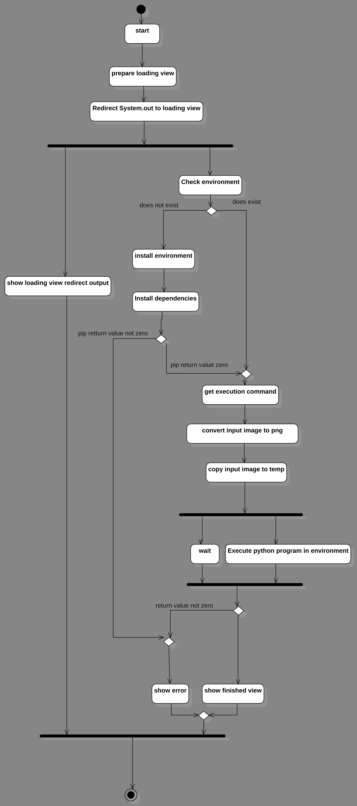
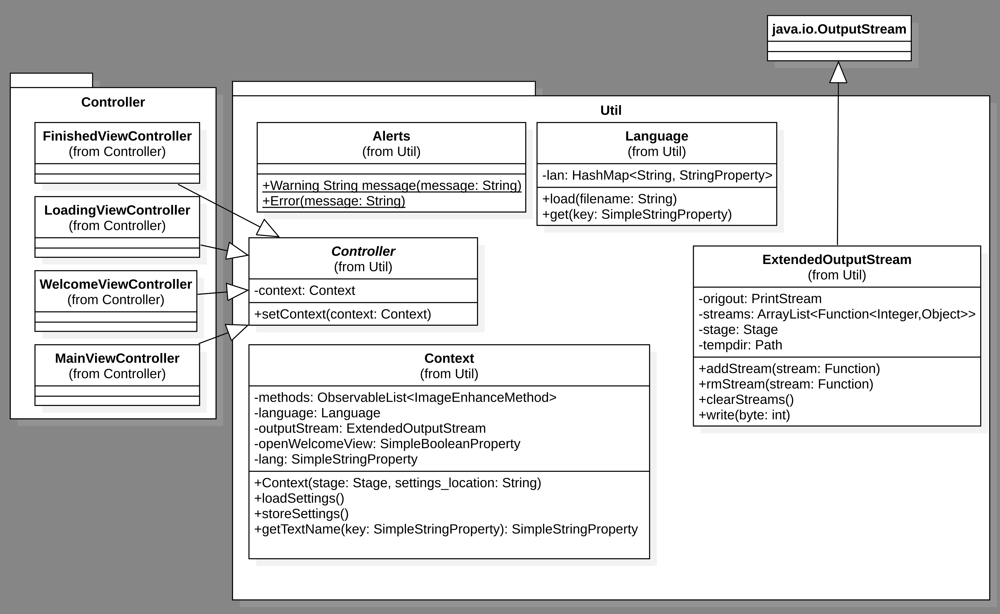
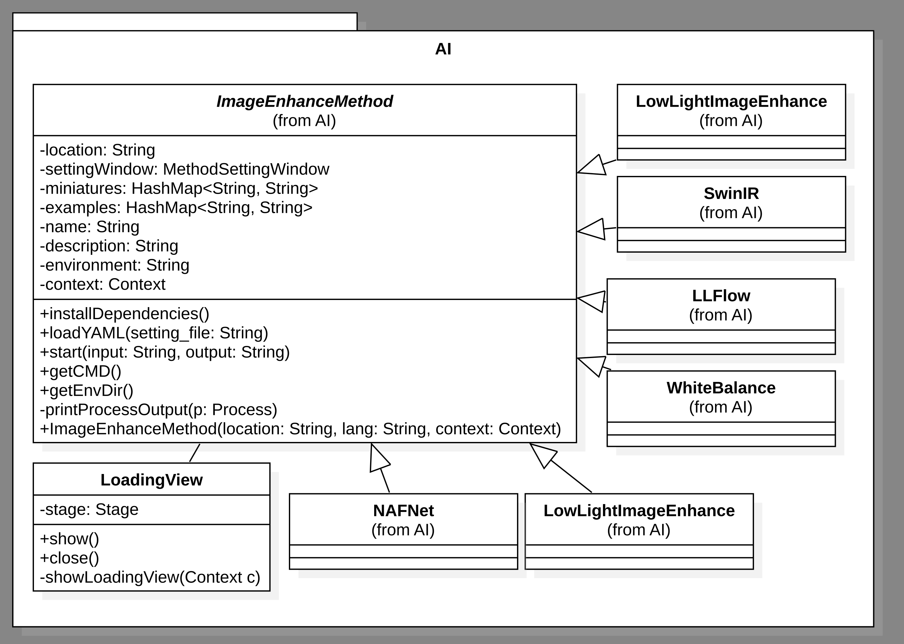
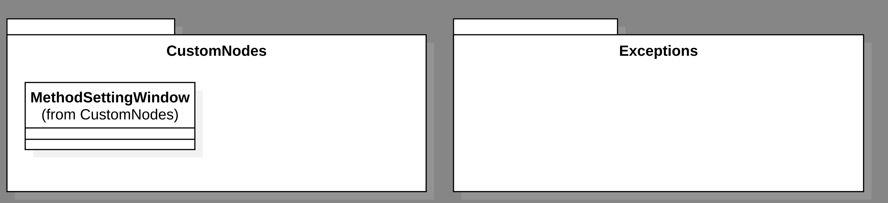

# Documentation for Image Enhance GUI (IEGUI)

By [Kilian Kier](https://github.com/kilian-kier), [Martin Gamper](https://github.com/mrtngamper), [Manuel Mitterrutzner](https://github.com/TubaComic), [Maximilian Perathoner](https://github.com/Maxnboy), [Michael Volgger](https://github.com/michaelV04)

TFO Fallmerayer 2022

---

### Contents
1. [Participants](#participants)
2. [Requirements](#requirements)
   - [Enhance algorithms](#enhance-algorithms)
   - [Programming languages and frameworks](#programming-languages-and-frameworks)
   - [Development process](#development-process)
      - [Waterfall model](#waterfall-model)
3. [Design](#design)
    - [Use Case](#use-case)
    - [UI Concept](#ui-concept)
      - [Welcome View](#welcome-view)
      - [Main View](#main-view)
      - [Setting View](#setting-view)
      - [Loading View](#loading-view)
      - [Finished View](#finished-view)
    - [Sequence](#sequence)
    - [Enhancement process](#enhancement-process) 
    - [Classes](#classes)
    - [File structure](#file-structure)
    - [About testing](#about-testing)
4. [Daily documentation](#daily-documentation)
    - [Design phase](#design-phase)
    - [Code phase](#end-of-design-phase-and-start-of-coding-phase)
5. [Temporary resume](#temporary-resume)
    - [What worked](#what-worked)
    - [What did not](#what-did-not)
    - [Prospect](#prospect)
6. [Resume](#resume)


## Participants
This project was initiated by the information technology teachers of the TFO J. Ph. Fallmerayer which teach
the class 4BT.

| Tasks       | Team                                                                                    |
|:------------|:----------------------------------------------------------------------------------------|
| Development | Maximilian Perathoner, Michael Volgger, Manuel Mitterutzner, Martin Gamper, Kilian Kier |
| Stakeholder | IT teachers - TFO J. Ph. Fallmerayer                                                    |**


## Requirements
The team was given the task to develop a program using an object-oriented programming language
wich has a graphical user interface. The team should provide documentation, select a software development process, 
document daily changes, use git as a version control system and use a test environment. The development was set to three weeks.

The team decided to create a GUI  which allows the user to open
image files, select an artificial-intelligence-supported enhance-algorithm 
and store the output into a new file.
These algorithms are mostly state-of-the-art algorithms in their respective field and released on GitHub.
The team also chose to enable the program to switch language during runtime and include a tutorial.

### Enhance algorithms
The team chose to implement the following options

| Name                                               | Tasks (usable in IEGUI)             | GitHub                                                                       | License                                                                                           |
|:---------------------------------------------------|:------------------------------------|:-----------------------------------------------------------------------------|---------------------------------------------------------------------------------------------------|
| SwinIR                                             | - super-resolution<br/> - denoising | [link](https://github.com/JingyunLiang/SwinIR)                               | [Apache](../EnhanceMethod/SwinIR/LICENSE)                                                         |  
| NAFNet                                             | - denoising<br/> - deblurring       | [link](https://github.com/megvii-research/NAFNet)                            | [MIT](../EnhanceMethod/NAFNet/LICENSE)                                                            |   
| mixedillWB                                         | - white balance                     | [link](https://github.com/yanxiang-wang/mixedillWB)                          | [Attribution-NonCommercial-ShareAlike 4.0 International](../EnhanceMethod/mixedillWB2/LICENSE.md) |  
| Low-light-Image-Enhancement                        | - low light enhancement             | [link](https://github.com/pvnieo/Low-light-Image-Enhancement)                | [MIT](../EnhanceMethod/Low-light-Image-Enhancement/LICENSE)                                       | 
| GAN Prior Embedded Network                         | - face enhancement                  | [link](https://github.com/yangxy/GPEN)                                       | © Alibaba, 2021. For academic and non-commercial use only.                                        |
| Low-Light Image Enhancement with Normalizing Flow  | - low light enhancement             | [link](https://github.com/wyf0912/LLFlow)                                    | [Attribution-NonCommercial-ShareAlike 4.0 International](../EnhanceMethod/LLFlow/LICENSE)         |

### Programming languages and frameworks

The team also chose to use these programming languages and frameworks. 

| Task              | Language/Frameworks/Tools |
|:------------------|:--------------------------|
| GUI               | JavaFX                    |  
| Backend           | Java                      |   
| Image enhancement | Preferably python         |
| Tests             | JUnit                     |
| Documentation     | Markdown + Java Docs      |
| Collaboration     | WhatsApp                  |
| Diagram creation  | StarUML                   |
| VCS               | Git on GitHub             |

### Development process
For development the team chose to use the __*waterfall model*__. Since it was given very little
time a linear approach seemed appropriate.

#### Waterfall model
The basic waterfall model breaks down a development process into five phases with their respective results.

- System and software requirements ->  requirements document
- Design -> software architecture
- Coding -> development, proving, and integration of software
- Testing -> discovery and debugging of defects
- Operations -> installation, migration and maintenance

The downside of this process is the lack of flexibility. As the requirements were very clear the team decided that an iterative
model would not be necessary.
Furthermore, the model was mainly used as a reference. The team decided to allow minimal changes of the design during the
development process if the whole team was informed.

## Design


### Use Case
During the design phase the team defined a basic use case.
 <p align="center">
      
    </p>
A user should be able to do the following actions:

- Enable the help on startup
- Close the program
- Change the language
- Select an image file, or drag and drop a file into the program
- Select the enhance method
- Start the enhancement

The UI, on the other hand should enable these interactions.

A logic thread should only be active once, during the enhancement process.

### UI Concept
In addition to the use case, an initial design layout of the different views, the user interface 
should provide, was proposed.

- #### Welcome View
  The Welcome View should be displayed on startup. It should provide a tutorial on how to use
 the program. Additionally, there should be a checkmark to disable the startup behaviour. <br /><br />

   <p align="center">
      
    </p>


- #### Main View
  The Main View should provide the option to select an image and then select an image-enhance-option.
  At the top a Menu Bar should be displayed with the Items File, Settings and Help. With the following options.
    - File
        - Open (file dialog)
        - Exit (quit program)
    - Settings
        - Language (select language)
        - Tutorial on Startup (enable or disable Welcome View)
    - Help
        - About <br /><br />

  Under the Menu Bar should be a miniature version of an opened image its file name.
  It should be possible to drag and drop other files into this area.
  The most important element of this view should be a List View containing the names and example images of
  different enhance methods. On click a Setting View should replace the List View. <br /><br />
   <p align="center">
      
    </p>
  
- #### Setting View
  The Setting View should provide detailed
  information about a selected image enhance method and an option to return to the Main View. 
  The methods description and examples should be contained in a List View.
  At the bottom or the top of this List View a method specific field for options should be displayed.
  At the bottom of the whole View a button should be provided to start the enhance process.<br /><br />
   <p align="center">
      
    </p>

- #### Loading View
  The Loading View should be displayed while calculating the output image. It should mostly provide
a graphical indication, that the enhancement process is running. The implementation is free to the responsible
team member.

- #### Finished View
  This view should contain a comparison between the input and the output image after the enhancement process has been finished
  It should contain a button to return to the Main View.

These are guidelines which may help team members responsible for a specific View during the implementation process, but
they are not obligatory and the design may change, as long as the same functionality is provided.


### Sequence
The interactions between the different Views should be as follows.
  <p align="center">
      
    </p>

### Enhancement process
To enhance an image after a user selected a method, java will need to interact with different python projects.
Because of that, an environment has to be set up before execution.
 <p align="center">
      
    </p>

### Classes
The following classes and packages were defined. The main package should be the util package. This package should contain
the language implementation as well as the Context, which is accessible to every JavaFX controller
and contains all the data, which can be stored and loaded into the settings.yml file.

<p align="center">
      
    </p>

The AI package should contain the abstract class ImageEnhanceMethod which loads data from config files. 
Every enhancement-method should have its on class which extends ImageEnhanceMethod and implements the getCMD() method.

<p align="center">
      
    </p>

Additionally, some classes may be added to the CustomNodes or Exceptions package when needed by an implementation.
<p align="center">
      
    </p>

### File structure
Also, a file structure was specified. The enhancement-methods should be in its corresponding folder and contain
a config file. This file should contain, the values of the attributes of ImageEnhanceMethod, including
the environment in which this method should be executed. The environment requirements should be 
contained in the Environments folder. The environments should be created in the same folder.
Other important folders are the Settings folder and the Language folder. Both should contain a yml
file which contain a map of the stored data.
```
├── Documentation
│   ├── Images
│   └── README.md
├── EnhanceMethod
│   └── ExampleMethod
│       └── Config
│           └── en.yml
├── Environments
│   └── environment_file.txt
├── Language
│   └── en.yml
├── README.md
├── Settings
│   └── settings.yml
└── src
    ├── java
    └── src
        └── main
            ├── java
            │   └── com
            │       └── example
            │           └── iegui
            │               ├── AI
            │               ├── controller
            │               ├── CustomNodes
            │               ├── Exceptions
            │               └── util
            └── resources
                └── com
                    └── example
                        └── iegui
                            └── views.css
```

### About testing
Test cases may be implemented using JUnit for critical processes, as needed.
As the team's development process is mostly linear, testing may also be 
implemented to simplify later modifications to the project after the deadline.

### Code documentation
The team decided to document the code using Java Docs. A render of this documentation will
be added after finishing the project to simplify modifications in the future.

## Daily documentation

### Design phase
#### 09-05-22
- __Up to Commit: Update README.md__ <br> 
A GitHub repository was created and a basic README was uploaded. Collaborators
were added to the repository and every collaborator was given a branch.

#### 10-05-22
- The planning phase began, the requirements were established and a basic use-case-diagram was created.

#### 11-05-22
- __Commit: JavaFX Setup__ <br>
A basic JavaFX project folder was uploaded to the repository

#### 12-05-22
- Basic classes were defined and a basic class diagram was created

- __Up to Commit: Further Preparation and Experimentation__ <br>
An updated JavaFX project folder was uploaded with a basic class and
folder design including JavaDoc documentation. The SwinIR project folder was embedded into
the IEGUI folder structure. A settings file was added to the config folder in SwinIR as well as an implementation of
a reader for the settings as a proof of concept to test the yaml file format.

- __Commit: Concept__ <br>
The UIConcept.md file was added to the repository. It contained basic information about the UI design with reference images.


### End of design phase and start of coding phase

#### 13-05-22
- During that day the coding phase began after the basic inner workings of IEGUI were defined. Before the Tasks for each developer were specified.
- __Commit: Concept__ <br>
The UIConcept.md was extended with detailed descriptions for the different views as well as a basic folder and class structure.
- __Commit: Language__ <br>
The language backend was defined in the UIConcept.md file
- __Commit: Language backend__ <br>
The language backend was implemented.
- __Commit: Welcome view added__ <br>
The fxml File and the Controller got added and updated.

#### 17-05-22
- __Commit: Settings__ <br>
A Settings implementation has been made. It provided the option to store and load data contained
in an instance of context.
- __Commit: WelcomeView + MainView merged__ <br>
The two views and their affiliated controllers have been merged. The main application has also been adapted.
- Commit: WelcomeView updated__ <br>
A pagination and a button got added and implemented. 

#### 18-05-22
- __Commit: Fix WelcomeView__ <br>
Fixed bug which resulted in a NullPointerException

#### 19-05-22
- __Commit: MainView upload picture feature__ <br>
A button to choose a the picture to process with an additional drag and drop option and picture display has
been implemented.

#### 20-05-22
- __Commit: Create and setup python environment__ <br>
Code to setup an environment for SwinIR was added to ImageEnhanceMethod.java as well as SwinIR.java
- __Commit: Fix: Drag and Drop__ <br>
Fixed the feature so it behaved exactly like the button.

#### 24-05-22
- __Commits by mrtngmaper up to Low-light enhancement, SwinIR, Auto-white-balance working__ <br>
Additional enhance-methods were added to the project, a standard implementation of start() was moved
from SwinIR to ImageEnhanceMethod, as the other enhance-methods could use the same backend, while using
different execution commands, which could be added via the getCMD() method, every ImageEnhanceMethod must implement.
- __WelcomeView Visual Update__ <br>
WelcomeView got a Visual update 
- __FinishedView added__ <br>
Finished View got added and implemented.

#### 25-05-22
- __Commit: Method display__ <br>
First version of the display of all available methods with title and short description.

#### 26-05-22
- __Commit: Visual Update__ <br>
.css file got added to all fxml files.


#### 27-05-22
- __Commit: Two additional methods__ <br>
  Two additional enhance-methods were added to the project (LLFlow, NAFNet). All model files were removed from the project and added to Google Drive,
  because GitHub only allows file sizes up to 100mb.

#### 28-05-22
- This documentation was added to the project, the Concept.md became obsolete.


## Temporary resume 
#### What worked
Up until June 28th, one week from the deadline, the development team was able
to create basic implementations of the different views wich were previously specified.
The WelcomeView was implemented, it was possible to select or drag & drop images 
into the MainView. It was also possible to run enhance images using a simple interface in java.

#### What did not
It was still not possible to select an image-enhance-method from the GUI and descriptions
for the different algorithms were still missing, as well as settings nodes for the methods.
The overall design of the different views could still be improved.
Languages other than english were still not available.

#### Prospect
It seemed to be possible to finish the project during the following week, even though
there might not be left much time. The right development process was chosen, as only very few
design specifications had to be changed, the most sever being the need for an installer, 
because of the size of some model and the GitHub file size limitation.

## Resume
The project is still under development
