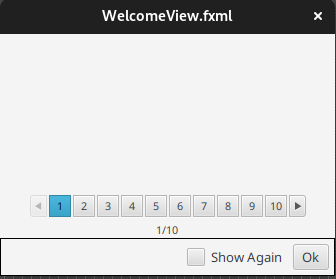
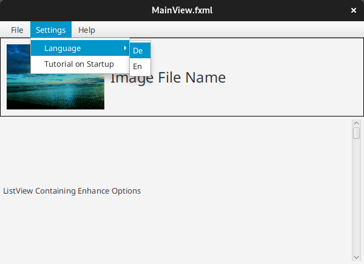
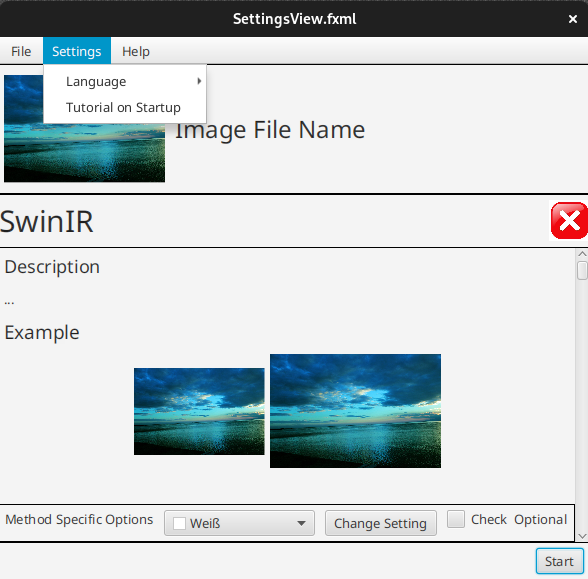

## Image Enhance GUI Concept

### Contents

1. [Idea](#Idea)
2. [GUI](#gui)
   - [Welcome View](#welcome-view)
   - [Main View](#main-view)
   - [Setting View](#setting-view)
4. [License and Acknowledgement](#license-and-acknowledgement)
### Idea

The goal of this project is to provide a GUI for different AI supported image enhance algorithms.
We would like to include the following options:

- [SwinIr](https://github.com/JingyunLiang/SwinIR) (Image Super-Resolution, JPEG Artifact Removal, Image Denoising)
- [DPIR](https://github.com/cszn/DPIR) (Image Super-Resolution, Image Deblurring)
- [Low-light-Image-Enhancement](https://github.com/pvnieo/Low-light-Image-Enhancement)
- [Auto White-Balance Correction](https://github.com/mahmoudnafifi/mixedillWB) 

### GUI

The GUI will be written using JAVA11 and JAVAFX.
Hereafter, are listed some concept views of the different windows.
- #### Welcome View
    The Welcome View will be displayed on startup. It lets the user explore the different
Available algorithms and contains explanations, for what each module does. By default it will appear on avery startup.
This behavior can be disabled using a checkbox. In the Main View it will be possible to enable the Welcome View again.
The Main View will appear after clicking Ok.  

  
   

      
    

  

- #### Main View
    The Main View will be used to select an image and then select an Image Enhance Option.
    At the top will be a Menu Bar with the Items File, Settings and Help. With these Options.
  - File
    - Open (file dialog)
    - Exit (quit program)
  - Settings
    - Language (select language)
    - Tutorial on Startup (enable or disable Welcome View)
  - Help
    - About   
    
  Under the Menu Bar should be a miniature version of an opened window and the file name. 
 It should be possible to drag and drop other files into this area.
The most important element of this view will be a List View containing the names and example images of 
different enhance methods. On click a Setting View should appear on the bottom.   
   

      
    

- #### Setting View
   The Setting View will be used to display detailed 
information of a selected image enhance method. It displays the name a description and example Images of the Method.
It should also be possible to return to the Main View. The description and examples should be contained in a List View.
At the bottom of which a method specific field for Options should be displayed. It is contained in the ImageEnhanceMethod
Class and can be accessed via the getSettingWindow() method. At the bottom a start button should be displayed. On click the
start method of an ImageEnhanceMethod

   

      
    

  

